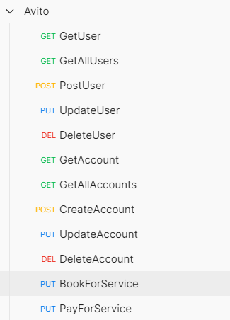
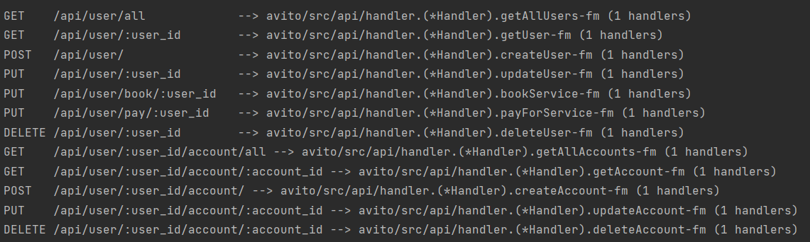

# balance-api
My implementation of microservice that's deal with user's accounts balances
## Using
Balance-api accepts requests and returns responses in json-format

1. clone repo:
   `git clone https://github.com/Gvozdoslav/avito_internship`
2. run docker-compose file
3. run src/data/database/InitDb.sql script to init database
4. launch an app

## CRUD operations
### 1. Get
func (u *UserService) GetUser(id int) (*dto.UserDto, error)

func (a *AccountService) GetAccount(id int) (*dto.AccountDto, error) 

### 2. Create
func (u *UserService) CreateUser(userDto *dto.UserDto) (*dto.UserDto, error) 

func (a *AccountService) CreateAccount(accountDto *dto.AccountDto) (*dto.AccountDto, error)

### 3. Update
func (u *UserService) UpdateUser(id int, userDto *dto.UserDto) (*dto.UserDto, error)

func (a *AccountService) UpdateAccount(id int, accountDto *dto.AccountDto) (*dto.AccountDto, error)

### 4. Delete
func (u *UserService) DeleteUser(id int) (bool, error)

func (a *AccountService) Delete(id int) (bool, error)

